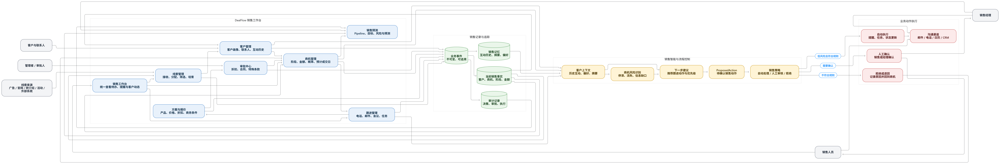
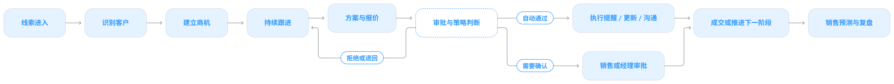

# DealFlow

事件驱动、人机协同（Human-in-the-loop）的销售工作流引擎。

事实只能由外部事件声明，系统只提建议、不擅自执行：决策（Decision）只输出 ProposedAction，策略（Policy）决定 Auto / Human Review / Reject，全程写入只追加审计日志。

---

这是什么

# DealFlow 把「一条线索从进线到成交/丢单」的跟进闭环，做成一个可恢复、可审计、可人审的事件驱动引擎：

1. 接收并去重 lead.created；
2. 为 Lead 分配负责人（lead.assigned）；
3. 根据当前事实和策略决定下一步跟进动作；
4. 接收外部结果事件（email.sent / email.replied / meeting.scheduled / proposal.sent / task.overdue …）；
5. 用结果事件恢复或重新规划 Workflow；
6. 把 Deal 推进到 won / lost 或继续等待。

它不替你发邮件、建会议——它只建议这些动作，经 Policy 判定、必要时经人工审批后，才通过接口化的 Executor 派发，并用「结果事件回执」确认动作真的发生了。

图：从左到右是「外部事实来源 → 接入层（Webhook + 控制面）→ WorkflowEngine 闭环（登记 → 恢复 → 状态机 → Decision → Policy → Executor）→ 外部副作用出口」，底部是接口化端口与运行时底座，右侧是交付的产品能力。矢量版见 docs/diagrams/dealflow-product-architecture.svg。

核心设计原则

  概念              	规则                                      
  Event           	不可变，必含 event_id、type、version、occurred_at、idempotency_key、payload
  State           	只存当前事实                                  
  Memory          	存历史互动、摘要、偏好                             
  Audit Log       	只追加，不可修改                                
  Decision        	只输出 ProposedAction，不能直接 Execute         
  Policy          	决定 Auto / Human Review / Reject         
  Store / Executor	全部接口化，先提供 InMemory 实现（生产固定用 SQLite）     

技术栈与要求

  项      	说明                                      
  语言     	TypeScript（无构建步骤，源码直接被 Node 执行）         
  校验     	Zod（配置与事件信封）                            
  测试     	Vitest（先写测试，再写实现）                       
  存储     	Node 内置 node:sqlite（单库 WAL，InMemory 仅供测试）
  HTTP   	node:http，无框架                           
  运行时依赖  	仅 zod                                   
  Node.js	>= 22.22.0（固定于 .nvmrc / .node-version，启动时 checkRuntime() 校验，版本不足直接退出码 1）

为什么固定 Node 版本：项目依赖 --experimental-transform-types 与 node:sqlite 两项 Node 22 实验特性，且无打包器（用 scripts/register.mjs + scripts/ts-resolve.mjs 补全无扩展名相对导入）。详见 docs/deployment.md。

---

快速开始（约 2 分钟）

1. 安装 Node 22.22.0

    nvm install && nvm use      # 读取 .nvmrc；或用其他方式安装 22.22.0
    node --version              # 期望 v22.22.0

2. 安装依赖

    git clone https://github.com/cnpetershen/DealFlow.git
    cd DealFlow
    npm ci        # 生产/CI：按 package-lock.json 精确安装

3. 配置（可选）

零配置即可启动——所有环境变量都有确定性默认值。想用人工审批面板（控制面）时，复制示例配置并设一个 Token：

    cp .env.example .env
    # 编辑 .env：至少给控制面一个 Token，否则审批相关路由按设计返回 404
    #   DEALFLOW_CONTROL_PLANE_TOKEN=dev-token

npm start / npm run dev / npm run backup 会自动加载仓库根目录的 .env（不存在则忽略；进程环境变量优先于 .env）。完整变量表见 .env.example 与 docs/deployment.md 第 3 节。

4. 启动

    npm run start

看到这条日志即启动成功：

    {"level":"info","message":"dealflow.ready","url":"http://127.0.0.1:3000"}

其他常用命令：

  命令                             	用途                           
  npm run start                  	前台运行（生产）                     
  npm run dev                    	--watch，改动自动重启（开发）           
  npm run backup                 	SQLite 一致性备份（VACUUM INTO，不停机）
  npm run typecheck              	tsc --noEmit                 
  npm run test / npm run test:run	全量单测（监听 / 一次跑完）              
  npm run accept                 	一键验收（CI 入口，见下）               

5. 验证它真的跑起来了

    ## 1) 存活探针（无鉴权）
    curl -s http://127.0.0.1:3000/healthz
     → {"status":"ok"}
    
    # 2) 投一个「新线索」事件
    curl -s -X POST http://127.0.0.1:3000/webhooks/dealflow \
      -H 'content-type: application/json' \
      -d '{
        "event_id": "evt_01", "type": "lead.created", "version": 1,
        "occurred_at": "2026-09-26T09:15:00+08:00",
        "idempotency_key": "lead.created:demo:1", "source": "crm",
        "payload": {
          "lead_id": "lead_a", "source_channel": "web_form",
          "source_record_id": "sd-1", "company_name": "蓝鲸科技",
          "contact_id": "contact_a", "initial_owner_id": null
        }
      }'
     → {"status":"processed","event_status":"processed",
        "workflow_id":"wf_lead_follow_up_lead_a","workflow_status":"running"}
    
    # 3) 看线索已落库（需要控制面 Token）
    curl -s -H 'Authorization: Bearer dev-token' http://127.0.0.1:3000/leads/lead_a

注意：默认 DEALFLOW_PROVIDER_KIND=in-memory，动作只在内存里「执行」，不真的发邮件/建会议。要接真实提供商，设 DEALFLOW_PROVIDER_KIND=http 与 DEALFLOW_PROVIDER_BASE_URL（见 docs/deployment.md）。

---

一键验收（跑通完整闭环）

    npm run accept

这一步就是 CI 做的事，等价于：

    typecheck → 全量单测（49 文件 / 642 用例）→ 自起干净实例 → 21 事件走查 → 19 项 MVP 断言

- 自带实例生命周期（默认端口 3199、临时库、结束即清理），报告写到 acceptance/report-<时间戳>.json，退出码 0 = 全绿；
- CI（.github/workflows/ci.yml）在 ubuntu-latest 与 windows-latest 上跑 npm ci && npm run accept，两个平台都跑是为了覆盖 Windows 与 POSIX 在子进程启动方式上的差异。

只想快速验安装，用这两条就够：

    npm run typecheck
    npm run test:run

想手工演一遍完整业务闭环（21 个事件：进线 → 分配 → 审批 → 回复 → 约会议 → 建商机 → 推阶段 → 成交），见 docs/operations.md 第 9 节，或直接：

    # 终端 A：独立库、独立端口、dev-token
    DEALFLOW_DB_PATH=data/sales-daily.db DEALFLOW_PORT=3123 DEALFLOW_CONTROL_PLANE_TOKEN=dev-token npm start
    # 终端 B
    node scripts/sales-day-walkthrough.mjs

---

端点速览

  方法  	路径                                      	鉴权                          	说明           
  GET 	/healthz                                	无                           	存活探针         
  GET 	/metrics                                	无                           	运行时指标快照      
  POST	/webhooks/dealflow（DEALFLOW_WEBHOOK_PATH）	可选 Bearer / HMAC / 限流 / 重放保护	接收业务事件（唯一写入口）
  GET 	/workflows /workflows/{id}              	控制面 Token                   	看流程/待审队列     
  POST	/workflows/{id}/approve /reject /replan /cancel /retry /reconcile	控制面 Token                   	人工审批与控制操作    
  GET 	/leads /leads/{id} /deals /deals/{id}   	控制面 Token                   	销售只读看板       
  GET 	/audit /exceptions                      	控制面 Token                   	审计链 / 异常队列   
  POST	/exceptions/{id}/resolve /discard /replay	控制面 Token                   	异常处理与重放      

完整端点与返回码语义见 docs/deployment.md 第 5 节与 docs/operations.md。

---

项目结构

    src/
      app/            # 装配（bootstrap）、运行时校验、信号/优雅关闭
      config/         # Zod 环境配置（非法值启动即失败）
      events/         # 事件信封校验 + 事件字典
      state-machine/  # Lead / Deal / Workflow 状态机
      decision/       # Decision：只输出 ProposedAction
      policy/         # Policy：Auto / Human Review / Reject
      executor/       # Executor 接口 + InMemory 实现
      provider/       # Provider Adapter（in-memory / http）+ 对账
      stores/         # 接口化 Store（InMemory + SQLite 双实现）
      workflow/       # WorkflowEngine（核心编排）
      runtime/        # 失败重试调度、SQLite 备份
      http/           # Webhook、控制面、限流、HMAC、重放保护
      observability/  # 结构化日志 + 指标
      testing/        # 测试夹具
    scripts/          # TS 解析钩子（运行时必需）+ 验收/走查脚本
    docs/             # 领域/事件/状态机/部署/操作/验收文档
    data/             # 本地 SQLite 业务库与备份（.gitignore 忽略）
    acceptance/       # 验收运行产物（.gitignore 忽略）

文档索引

  文档                                	内容                             
  docs/running.md                   	运行：环境 → 配置 → 启动 → 恢复 → 关闭 → 排障 
  docs/operations.md                	操作：投事件、看板、审批、异常、对账、巡检          
  docs/deployment.md                	部署：环境变量、systemd、Webhook 安全、备份恢复
  docs/domain.md                    	领域模型、审计/异常/对账契约                
  docs/events.md                    	事件字典与信封约束                      
  docs/state-machine.md             	状态机                            
  docs/decision-policy.md           	Decision 与 Policy 判定规则         
  docs/mvp.md                       	MVP 最小闭环验收标准                   
  docs/acceptance-single-instance.md	单实例验收的断言与判定基准                  

已知取舍

- 单实例部署：限流与重放缓存是进程内状态；SQLite 同一时刻只允许一个写事务，同一个库文件不要被多个进程同时写入。
- 运行在 Node 22 的实验特性上（--experimental-transform-types、node:sqlite），升级 Node 必须回归 src/stores 全部测试。
- 事件与审计只追加、无归档策略，会持续增长（查询路径已索引化）。
- 控制面是内部运维接口，必须配置 Token 才启用，建议只在内网/VPN 暴露。
- 更多见 docs/mvp.md「已知取舍」与 docs/operations.md 第 11 节。

License

private（暂未发布到 npm，无开源许可证）。
